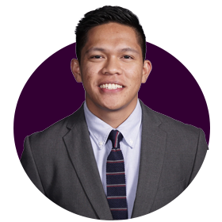

  
  <h1>Anthony Onde Morada, MD</h1>
  
General Surgery Resident (PGY-4) | Transplant Surgery Researcher

  
Geisinger Northeast General Surgery Program 
  UCSB Alumnus | Cedars-Sinai Transplant Research (2015-2017)

  
  

    
    
   
  

---

## 📄 Quick Navigation

  <a href="cv.html" class="nav-card">
    📋 View Full CV
  </a>
  <a href="cv-downloads/anthony-morada-cv.pdf" class="nav-card" download>
    📥 Download PDF
  </a>
  <a href="cv-downloads/anthony-morada-cv.docx" class="nav-card" download>
    📝 Download Word
  </a>

  <em>Last Updated: November 2025</em> 
  <a href="cv.html">View Full CV</a> • <a href="cv-downloads/">Download CV Files</a>

---

## 📬 Contact

**Institutional Email:** [amorada1@geisinger.edu](mailto:amorada1@geisinger.edu)  
**Personal Email:** [anthony.omorada@gmail.com](mailto:anthony.omorada@gmail.com)  
**Phone:** +1 (909) 239-3581  
**ORCID:** [0000-0002-0428-6558](https://orcid.org/0000-0002-0428-6558) • **LinkedIn:** [anthonyomorada](https://linkedin.com/in/anthonyomorada) • **GitHub:** [anthonyomorada](https://github.com/anthonyomorada)

---

## 📊 Research Impact at a Glance

  

    <h3>7</h3>
    
Peer-Reviewed Publications

  

  

    <h3>21+</h3>
    
Conference Presentations

  

  

    <h3>92K+</h3>
    
Patients in Genomic Data Analysis

  

  

    <h3>$200K+</h3>
    
Fundraised for Cancer Research

  

---

## 🎯 Research Focus

**Systematic Reviews • Clinical Outcomes • Transplant Surgery**

From computational genomics at Geisinger's DiscovEHR to clinical research at Cedars-Sinai's Liver Transplant program, my work bridges data science and surgical innovation. Currently applying systematic review methodology and outcomes research to advance evidence-based surgical practice.

**Key Areas:**
- Transplant surgery outcomes and quality improvement
- Systematic reviews and meta-analyses in surgery
- Genomic medicine applications (92,297 patient cohort analysis)
- COVID-19 predictive modeling and triage algorithms

---

## 🔬 Selected Publications

1. **Morada AO**, Senapathi SH, Bashiri A, Chai S, Cagir B. A systematic review of primary ileostomy site malignancies. *Surg Endosc*. 2022;36(3):1750-1760. PMID: 34997348 [[PDF](publications/2022-ileostomy-review.pdf)] [[PubMed](https://pubmed.ncbi.nlm.nih.gov/34997348/)]

2. **Morada AO**, Scheidel C, Brown JL, et al. Predicting severe COVID-19 outcomes for triage and resource allocation. *MedRxiv*. 2021. [[Preprint](https://doi.org/10.1101/2021.04.12.21255201)]

3. Bashiri A, **Morada A**, Sultany M, et al. Trends of trauma admissions during COVID-19 pandemic. *J Surg Res*. 2023;289:202-210. PMID: 37141703 [[PubMed](https://pubmed.ncbi.nlm.nih.gov/37141703/)]

**[→ View all 7 publications in full CV](cv.html#publications)**

---

## 💼 Research Experience Highlights

### **Cedars-Sinai Medical Center Liver Transplant Program** (2015-2017)
**Clinical Research Data Specialist** • Department of Liver Transplant & Hepatobiliary Surgery

- Coordinated clinical trials for liver transplant recipients and living donor candidates under Dr. Nicholas Nissen
- Managed transplant outcomes biorepository with specimens from 500+ transplant patients
- IRB contact for liver transplant clinical trials evaluating immunosuppression protocols and rejection outcomes
- Statistical analyses for transplant surgery research publications using R/SQL programming
- Direct collaboration with transplant surgery faculty on post-transplant outcomes research

### **Geisinger DiscovEHR Project** (2017-2018)
**Genomic Data Analyst** • Weis Center for Research

- Analyzed whole exome sequences from **92,297 patients** in one of the largest healthcare genomic databases
- R/Python programming for rare disease variant identification in autosomal dominant conditions
- Focus on genetic diseases relevant to transplant medicine and familial conditions
- Awarded competitive grant funding from Summer Research Immersion Program

**[→ View Full Research Timeline in CV](cv.html#research-experience)**

---

## 🏆 Selected Recognition

  

    <strong>🥇 1st Place Oral & Poster Presentations</strong> 
    Stanley Conklin Research Day (2021)
  

  

    <strong>💰 Hacking Health Innovation Winner</strong> 
    $5,000 for Healthcare Innovation Project "ABBY" (2019)
  

  

    <strong>📈 #1 Fundraising Team - Two Consecutive Years</strong> 
    Pancreatic Cancer Action Network (2016-2017)
  

  

    <strong>🔬 Summer Research Grant Recipient</strong> 
    Geisinger Commonwealth School of Medicine (2018)
  

---

## 🎓 Professional Memberships

- **International Liver Transplantation Society (ILTS)**
- **American Society of Transplant Surgeons (ASTS)**
- American College of Surgeons
- American Medical Association
- Pennsylvania Medical Society
