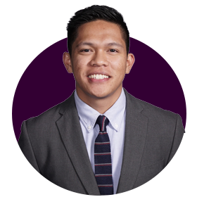

  
  <h1>Anthony Onde Morada, MD</h1>
  
General Surgery Resident (PGY-4) | Surgical Education and Outcomes Research

  
Geisinger Northeast General Surgery Program, Scranton, PA 
  Research interests in surgical education, hepatobiliary and transplant surgery, systematic reviews, and clinical outcomes.

  
  

    
    
   
  

---

## Curriculum Vitae Access

  <a href="cv.html" class="nav-card">
    View Full CV
  </a>
  <a href="cv-downloads/aom-cv.pdf" class="nav-card" download>
    Download PDF
  </a>
  <a href="cv-downloads/aom-cv.docx" class="nav-card" download>
    Download Word
  </a>

  <em>Last Updated: May 2026</em> 
  <a href="cv.html">View Full CV</a> • <a href="cv-downloads/">Download CV Files</a>

---

## Recent Updates

<ul class="updates-list">
  <li><strong>May 2026:</strong> Added two 2026 peer-reviewed publications in <em>Journal of Gastrointestinal Oncology</em> and <em>Trauma Surgery & Acute Care Open</em>, with full-text and PDF links.</li>
  <li><strong>May 2026:</strong> Presented surgical education work at the 2026 Association for Surgical Education Annual Meeting in Atlanta; manuscript in preparation for <em>Global Surgical Education</em>.</li>
  <li><strong>May 2026:</strong> Updated peer-review activity, published abstracts, and supporting publication PDFs to keep this electronic CV current and verifiable.</li>
</ul>

---

## Contact

**Institutional Email:** [amorada1@geisinger.edu](mailto:amorada1@geisinger.edu)  
**Personal Email:** [anthony.omorada@gmail.com](mailto:anthony.omorada@gmail.com)  
**Phone:** +1 (909) 239-3581  
**ORCID:** [0000-0002-0428-6558](https://orcid.org/0000-0002-0428-6558) • **LinkedIn:** [anthonyomorada](https://linkedin.com/in/anthonyomorada) • **GitHub:** [anthonyomorada](https://github.com/anthonyomorada)

---

## Research Impact

  

    <h3>11</h3>
    
Peer-Reviewed Publications

  

  

    <h3>31+</h3>
    
Conference Presentations

  

  

    <h3>92K+</h3>
    
Patients in Genomic Data Analysis

  

  

    <h3>$200K+</h3>
    
Fundraised for Cancer Research

  

---

## Research Focus

**Systematic Reviews • Clinical Outcomes • Transplant Surgery**

From computational genomics at Geisinger's DiscovEHR to clinical research at Cedars-Sinai's Liver Transplant program, my work bridges data science and surgical innovation. Currently applying systematic review methodology and outcomes research to advance evidence-based surgical practice.

**Key Areas:**

- Transplant surgery outcomes and quality improvement
- Systematic reviews and meta-analyses in surgery
- Genomic medicine applications (92,297 patient cohort analysis)
- COVID-19 predictive modeling and triage algorithms

---

## Selected Publications

<ol class="publication-list">
<li>
<strong>Morada AO</strong>, Chen CK, Akateh C, Marvin MR, Kotru A. Hepatocellular Carcinoma Metastasis to Salivary Glands: A Systematic Review of Diagnostic Challenges and Survival Outcomes. <em>J Gastrointest Oncol</em>. 2026. <a href="https://doi.org/10.21037/jgo-2026-1-0015">Full Text</a> | <a href="publications/2026-jgo-hcc-salivary-glands.pdf">PDF</a>
</li>
<li>
<strong>Morada AO</strong>, Kropp Lopez A, Droney A, Lopez R. Traumatic Page kidney: a systematic review and patient report of bilateral Gerota's fascia release. <em>Trauma Surgery & Acute Care Open</em>. 2026;11:e002041. <a href="https://doi.org/10.1136/tsaco-2025-002041">Full Text</a> | <a href="publications/2026-tsaco-page-kidney.pdf">PDF</a>
</li>
<li>
Bashiri A, <strong>Morada AO</strong>, Sultany M, Senapathi S, Silverman S, Casós S, Behm R. Trends of Trauma Admissions in a Rural Trauma Center During Coronavirus Disease 2019 Pandemic. <em>J Surg Res</em>. 2023;289:202-210. PMID: 37141703. <a href="https://doi.org/10.1016/j.jss.2023.02.040">Full Text</a> | <a href="publications/2023-jsr-trauma-admissions.pdf">PDF</a>
</li>
</ol>

**[View all publications in full CV](cv.html#publications)**

---

## Research Experience Highlights

### **Cedars-Sinai Medical Center Liver Transplant Program** (2015-2017)
**Clinical Research Data Specialist** • Department of Liver Transplant & Hepatobiliary Surgery

- Coordinated clinical trials for liver transplant recipients and living donor candidates under Dr. Nicholas Nissen
- Managed transplant outcomes biorepository with specimens from 500+ transplant patients
- IRB contact for liver transplant clinical trials evaluating immunosuppression protocols and rejection outcomes
- Statistical analyses for transplant surgery research publications using R/SQL programming
- Direct collaboration with transplant surgery faculty on post-transplant outcomes research

### **Geisinger DiscovEHR Project** (2017-2018)
**Genomic Data Analyst** • Weis Center for Research

- Analyzed whole exome sequences from **92,297 patients** in one of the largest healthcare genomic databases
- R/Python programming for rare disease variant identification in autosomal dominant conditions
- Focus on genetic diseases relevant to transplant medicine and familial conditions
- Awarded competitive grant funding from Summer Research Immersion Program

**[View Full Research Timeline in CV](cv.html#research-experience)**

---

## Selected Recognition

  

    <strong>1st Place Oral & Poster Presentations</strong> 
    Stanley Conklin Research Day (2021)
  

  

    <strong>Hacking Health Innovation Winner</strong> 
    $5,000 for Healthcare Innovation Project "ABBY" (2019)
  

  

    <strong>#1 Fundraising Team - Two Consecutive Years</strong> 
    Pancreatic Cancer Action Network (2016-2017)
  

  

    <strong>Summer Research Grant Recipient</strong> 
    Geisinger Commonwealth School of Medicine (2018)
  

---

## Professional Memberships

- **International Liver Transplantation Society (ILTS)**
- **American Society of Transplant Surgeons (ASTS)**
- American College of Surgeons
- American Medical Association
- Pennsylvania Medical Society
